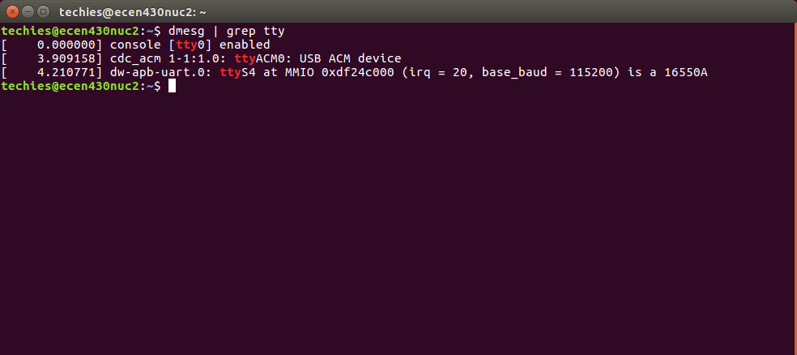
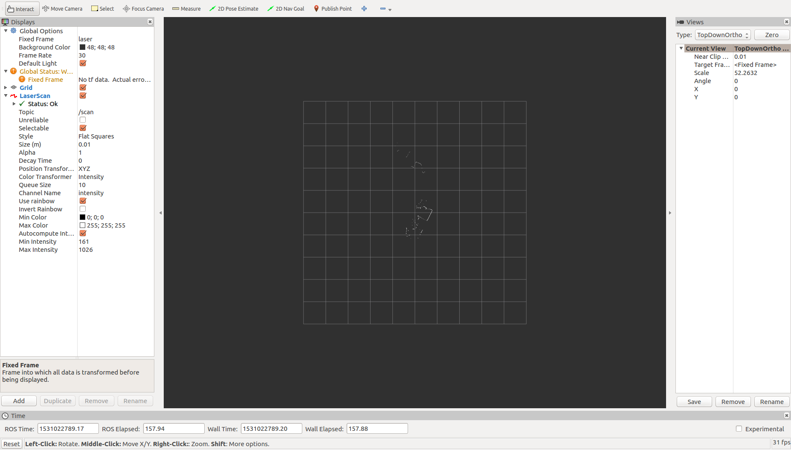

# ECEN 430 Tutorial Part 1

## ROS and Ubuntu Introduction 

### Command Line Refresher
ROS uses the Linux command line for the majority of programming and execution tasks. 
Before starting with ROS ensure that you are up to speed on how to navigate the Linux command line efficiently. 
The below lists common commands that you will use with the command line. 


### ROS Introduction 
ROS or Robot Operating System is middle-ware that sits between high-level control and the sensor/actuators. ROS was initially developed at Stanford University but has become a worldwide standard for robotic development. The ROS system consists of nodes, each node has a compute function to gather, manipulate or display data. Data is transferred between nodes on topics. A node can subscribe or publish data to/from any topic. Each topic has a message type, a message defines how the data is packetised. At a low-level ROS uses the TCP/IP stack for transferring data, this allows easy expansion over networked systems.  

#### Nodes 
A node is a process that performs computation, A combination of nodes is used to form a system. Nodes will usually operate on a fine grain scale, with one node responsible solely for one part of the system. For example, one node controls a laser range-finder, one Node controls the robot's wheel motors, one node performs localisation, one node performs path planning, one node provides a graphical view of the system, and so on.

By implementing a robotic system with this level of modularity, the system is easily adaptable and fault-tolerant. More information on nodes can be found [here](http://wiki.ros.org/Nodes). 


#### Topics
A topic is a bus over which nodes exchange messages. Nodes can send/receive data from a topic by publishing or subscribing to it. Generally, a node will not know who is publishing the data it is subscribed to, nor will it know who it is publishing too. A topic can have multiple subscribers and publishers. 

Topics are intended for unidirectional transport of data between nodes, for more advanced bidirectional data, services are used. Services are out of the scope of this tutorial, but more info can be found [here]( http://wiki.ros.org/Services)

Topics use the TCP/IP network communication layer, this means that nodes can be spread across the series of networked processors for distributed computation. More information on topics [here](http://wiki.ros.org/Topics)  

#### Messages 
Messages are how data is packetized when it is sent over a topic. A topic can only ever transport one message type.  Each message can consist of basic data types (int, char, string), more advanced ROS specific types (Header, pose) or other messages.   More info on messages [here](http://wiki.ros.org/Messages)

#### ROS Master (or ROS core)
When a node is initialised, it needs to know what other nodes are active in the system and where to send its data. This is the role of the ROS master. 

The ROS master is not actively involved in data transfer, rather, it makes sure all the nodes in the system are aware of each other. There must only be one ROS master in each ROS system. Typically the ROS master is wrapped in the ROS Core, a series of critical services and nodes for ROS.

More information on the [ROS master](http://wiki.ros.org/Master) and [ROS core](http://wiki.ros.org/roscore)


## 1B - LiDAR

> Note: The following chapters are written for ROS Melodic, in most cases other versions of ROS can be used by substituting the version name when installing packages. i.e` $ sudo apt-get install ros-kinetic-urg-node`.


LiDAR or Light Detection and Ranging is a technique used for determining the range to objects. The LiDARs you have today are the URG-04LX-UG01 and cost around \$1500 NZD. If you where writing code for these LiDARs from scratch you would need to write a UART driver and phaser to receive and unpack the data. However, with ROS, someone has done the grunt work for you.

The primary and preferred way of installing ROS nodes onto your systems is to use the `apt-get` command. Use the command below install the URG node onto your systems. 
```
 $ sudo apt-get install ros-melodic-urg-node 
 ```
 
Now plug in your LiDAR to the USB port on your NUC, the spindle should spin up and the LED start flashing. Use the`$ dmesg | grep tty` command to identify what serial port the LiDAR has been assigned. By default, it should be on `/dev/ttyACM0`. The image below shows what the dmesg output should look like. 



Using terminal, start the ROS Master:
```
$ roscore
```
Open a new terminal tab using `CTRL + SHIFT + T`. Using this terminal tab, start the urg_node with:
```
    $ rosrun urg_node urg_node _serial_port:=/dev/ttyACM0
```
Where the serial port is set to the serial port of the LiDAR. We can now verify that the LiDAR is sending data using the rostopic command-line tool. First, check that the urg\_node is publishing data on the `/scan`. In a new terminal tab, use the command:

```
    $ rostopic list
```

If the `scan` topic shows up in the list, use rosoptic to check the publishing frequency of the topic with:

```
    $ rostopic hz /scan
```

If the LiDAR is running correctly, it should be publishing data at 10~Hz. We can now visualise the data using rviz, launch it in a new terminal tab with:
```
    $ rviz
```

Using the panel on the left of RVIZ add the LiDAR data as shown below. To get the laser to show up, you will need to change the fixed frame of rviz from "map" to "laser". This tells RVIZ to display the data in relation to the coordinate system defined by the laser, not the map.  



Have a play with the LiDAR and figure out it's maximum range and scan area. Once you are done stop all the running programs. 


## 1C - Mapping

ROS includes a large number of mapping packages, one of the essayists to use is Hector Mapping as it only uses input from a LiDAR. To use Hector Mapping, we have to tell ROS the spacial relationship between the laser and the robot base, this is known as a TF or transform. As the laser will not be moving relative to the base of the robot, we can use a static\_tf\_publisher.

Rather than publishing the TF from a command-line tool, we will use a launch file. A launch file is an easy way of launching many different nodes from one command line tab. To create a launch file, we need first to create a ROS package. Using the command-line navigate to the src directory of the catkin\_ws using the command:

```
    $ cd ~/catkin_ws/src
```
If this directory does not exist, you will have to create it. Once here we can create the ROS package with the command:
```
    $ roscreate-pkg myFirstPackage std_msgs roscpp rospy
```

cd into the newly created myFirstPackage directory and create a new directory called launch, then cd into that:
```
    $ cd myFirstPackage
    $ mkdir launch
    $ cd launch
```

Your path should now be:`~/catkin_ws/src/myFirstPackage/launch/` . Copy the launch file  `hector_mapping.launch` included in this git hub repo into the current folder (bonus points for command line use). 


In this launch file, we launch the URG node for the LiDAR data, setup static transforms between the laser, odometry and base frames. As don't have a physical robot yet, the TF places all the frames on top of one another. If you want to use this launch file for your robots, you will need to update the measurements. Finally, the launch file will launch an instance of the hector mapping node. 

Before running this launch file we need to install hector mapping, unlike the URG node, there is no hector mapping build for ROS Melodic yet, so we can't use the `apt-get` command. Instead, we have to build hector mapping from its source. To do this, we need to get the source from git-hub.  

Change directorys to `~/catkin_ws/src/` and `git clone` the hector slam repo. 
```
git clone https://github.com/tu-darmstadt-ros-pkg/hector_slam
```

Now that we have the raw source code, we need to build it. ROS uses the CMAKE build system, something we'll get into next tutorial. To use this for now, we need to change directories to the `~/catkin_ws/ directory and call:
```
$ catkin_make
```
You should now have a warm, happy feeling as all the code you just pulled down compiles the first time.


After you code compiles, you will need to tell the terminal where to find it, luckily ROS has an auto-generated shell script that will do this for you. 
```
$ soruce ~/catkin_ws/devel/setup.bash
```
You will need to call this script in every open terminal window after you compile your code with `catkin_make`.
You should now beable to run the launch file, move back into its directory and use `roslaunch` to run it:

```
$ cd ~/catkin_ws/myFirstPackage/launch/
$ roslaunch hector_mapping.launch
```

If it all worked, you should have mapping working, now in another terminal run rviz and visualise the mapping output. If everything is running correctly, you should have your first ROS publisher-subsricer system. These can be easily visualised using the RQTgraph tool. In a new terminal tab run:
 
```
    $ rqt_graph
```

RQT graph is an excellent way of creating images for reports with minimal effort (hint-hint). Have a play with `rostopic` to have a look at the other topics hector mapping is generating. There are several other useful command-line tools for debugging ROS systems. 

  
* [roscd](http://wiki.ros.org/roscd)
* [rosrun](http://wiki.ros.org/rosrun)
* [rosmsg](http://wiki.ros.org/rosmsg)
* [rosnode](http://wiki.ros.org/rosnode)

An exhaustive list can be found [here](http://wiki.ros.org/ROS/CommandLineTools)
   
## 1D - Other Sensor Systems
You can now work on getting the remaineder of your sensors working, below is a list of ROS nodes you may want to use:

* SICK LiDAR - [LMS1xx](http://wiki.ros.org/LMS1xx)
* R200 Realsense Cameras - [librealsense](http://wiki.ros.org/librealsense) and [realsensecamera](http://wiki.ros.org/realsense_camera)
* D435 Realsense - [realsense2](http://wiki.ros.org/realsense2_camera)
* Razor IMU - [razor_imu_9dof](http://wiki.ros.org/razor_imu_9dof)
