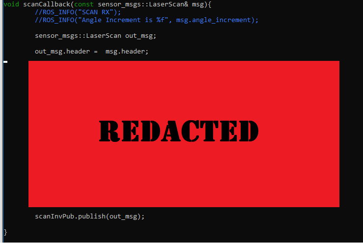

# Part 2 – Custom Nodes and other things
## Part 2.1 – Custom Nodes
Today we are going to write a custom node that will take in a LiDAR scan on the `\scan` topic and invert it (like the LiDAR is mounted upside down). We’ll start by subscribing to the data, then publish the inverted data. Before we start writing code, we need to create a new ROS package in the `catkin_ws/src` directory. Use the `catkin_create_pkg`, you’ll need to the include the `roscpp, rospy, std_msgs and sensor_msgs` dependencies. Name the package something sensible for the function it will have, ROS package names should be all lower case and written in snake case, not camel case. The docs for `catkin_create_pkg` are [here](https://catkin-tools.readthedocs.io/en/latest/verbs/catkin_create.html)     

## 2.1A – Subscribing

### 2.1A - C++ Code
Move into the package you just created and create and CD into a new `/src` directory. Now create a new C++ file call `scan_inverter.cpp` and open it with gedit (or an editor of your choosing). Copy and paste the boilerplate code from the `ros_node_boiler_plate.cpp` file in this repo, into your new C++ file. The comments should explain the function of each line of the code.

We are going to modify this code to print a message each time a new scan message is received. First we need to initialise the node and the subscriber. Change the name of the node in the `ros::init()` function to something sensible. Now create the subscriber on the `/scan` topic, create a long que of messages (say 1000) and set the call-back method as `scanCallback`. Without comments your code should look like this:
```
ros::init(argc,argv,"nodeName");
ros::NodeHandle nh;
ros::Subscriber scanSub = nh.subscribe("topicName",1000,scanCallback);
while(ros::ok()){
  ros::spinOnce();
}

```
ROS uses callbacks to service incoming messages, there is typically one callback per topic. In our example the majority of the "work" will be done in the callback.  Create a new function called `scanCallback` above the main function, this function should return nothing and have one argument: A constant pointer to the `sensor_msgs::LaserScan` message. In the main loop we declared subscriber that will call the `scanCallback` function every time a new message arrives. The subscriber also creates a que of events that is 1000 messages long, this allows the program to buffer slightly if the stream is too quick.     Depending on the application and the type of message you can vary the que size for optimal performance


In the call back function we will use the ROS console functions to print a string to the terminal. There are five levels of ROS console print call, these are ROS_INFO, ROS_DEBUG, ROS_WARN, ROS_ERROR and ROS_FATAL. ROS_DEBUG will only print messages to the terminal, while the remainder will be reported to the ROS master for several levels of logging. More information on the ROS console is [here](http://wiki.ros.org/rosconsole).

Using `ROS_INFO()` print a message in your callback to indicate that your program has received a LiDAR scan message.

 ```
 void scanCallback(const sensor_msgs::LaserScan& msg) {
  ROS_INFO("SCAN RX");
 }
 ```
As your program is using the the `sensor_msgs::LaserScan` message, you will need to include the header file for this message.  Include `#include  <sensor_msgs/LaserScan.h>` at the top of your code. Each message type in ROS has it's own header file, your program will need to include any messages you wish to use.  


### 2.1A - Setting Up CMake
After you have made the modifications to your code, the CMake build-system used by `catkin_make` needs to know where to find the code and necessary libraries. This is done by modifying the `CMakeLists.txt` in the root directory of your package. Modify this file and replace the terms in `*asterisks*`

```
cmake_minimum_required(VERSION 2.8.3)
project(*packageName*)

# Compile as C++11, supported in ROS Kinetic and newer
# add_compile_options(-std=c++11)

find_package(catkin REQUIRED COMPONENTS
  roscpp
  rospy
  sensor_msgs
  std_msgs
  messages_generation
)

generate_messages(
   DEPENDENCIES
   sensor_msgs
   std_msgs
 )

catkin_package()

include_directories(include ${catkin_INCLUDE_DIRS})

add_executable(*execName* src/scan_inverter_node.cpp)
target_link_libraries(*execName* ${catkin_LIBRARIES})
add_dependencies(*execName* scan_inverter_generate_messages_cpp)
```

The major changes are the addition of the three bottom lines:

`add_executable(*execName* src/scan_inverter_node.cpp)` tells the compiler to make `src/scan_inverter_node.cpp` into a new executable called `*execName*`. `target_link_libraries(*execName* ${catkin_LIBRARIES})` and `add_dependencies(*execName* scan_inverter_generate_messages_cpp)` then tell the compiler and linker where to find the libraries for the newly created executable.  

After you have modified the `CMakeLists.txt` file, you should be able to compile your program by running `catkin_make` in the `~/catkin_ws` directory. If you haven't made any mistakes catkin_make should exit cleanly with no errors. After the code has compiled, you will need to tell the terminal program where the newly created executables are. Run `source ~/catkin_ws/devel/setup.bash`, you will need to run this command every time you create a new executable/recompile any code.

>Remember to run the source command on every open terminal

You are now ready to test your program: start the `roscore` and the LiDAR node `urg_node` in their own terminal windows, then run your program with
```
$ rosrun *packageName* *execName*
```

The terminal that is running your program should now print every time a new `/scan` message is received.

    

### 2.1A - Reading message data
Now that we have our code reading successfully, we can print out some of the message contents. See the definition for the `sensor_msgs::LaserScan` message [here]( http://docs.ros.org/melodic/api/sensor_msgs/html/msg/LaserScan.html). Change the `ROS_INFO` line in your code this: ` ROS_INFO("Angle Increment is %f", msg.angle_increment);`


After you have made these changes

## 2.1B – Publishing Data
Now we have a working subscriber, we can build the inverted scan publisher.  At the global scope in your program instantiate a publisher variable:
 ```
ros::Publisher scanInvPub;
```
And in your main method assign it to a new publisher that publishes a `sensor_msgs::LaserScan` message on the `/scan_inverted` topic.
```
scanInvPub = nh.advertise<sensor_msgs::LaserScan>("/scan_inverted",1000);
```
In the `scanCallBack` function, create a new `sensor_msgs::LaserScan` message named `out_msg`. This will be the message that is published from the node.

Constuct the inverted LiDAR scan by  reversing the range and intensity  arrays and directly copying the rest of the data into the new message. Reminder: the LaserScan message definition is [here](http://docs.ros.org/melodic/api/sensor_msgs/html/msg/LaserScan.html).

After you have populated the fields in the new `out_msg`, it can be published with:
```
scanInvPub.publish(out_msg);
```
The completed `scanCallBack` should look like the image below:


Run your node in addition with the `urg_node` and check uisng RVIZ that the LiDAR is inverted.

## 2.2 - ROS over network

 > For this section you will need to partner up and have two NUCs per group.

As mentioned earlier ROS can work over a wireless network, there a few simple setup steps needed. When running a ROS system over a network be sure to consider bandwidth and latency, you should generally run all your processing on the “robot”.

You will need to know the IP addresses of the two NUCs you are using, get these by using the `ifconfig` command. The ROS master can only be running on one processor in a system, this should be the “main” processor.

On the system that is running the ROS master, run `sudo gedit .bashrc` to edit the terminal start up script.  Add the following lines swapping out the *masteripaddress* for the IP address of the master.
```
export $ROS_MASTER_URI = http:// *masteripaddress*:11311
export $ROS_IP = *masteripaddress*
echo ROS Master is: $ROS_MASTER_URI
```
On the system that is not running the ROS master add the following lines to the .bashrc script.
```
export $ROS_MASTER_URI = http:// *masteripaddress*:11311
export $ROS_IP = *slaveipaddress *
echo ROS Master is: $ROS_MASTER_URI
```

Now start `roscore` and the `urg_node` on the master system and `rviz` on the slave. You should be able to "see" the topics available on both systems.
